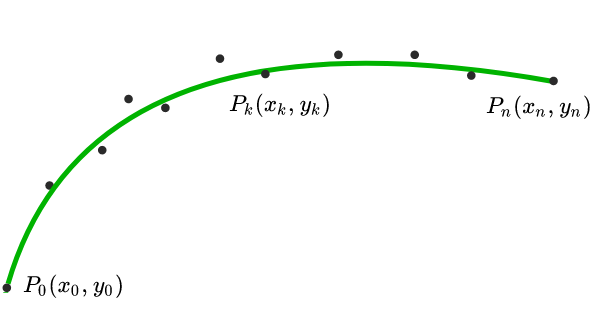
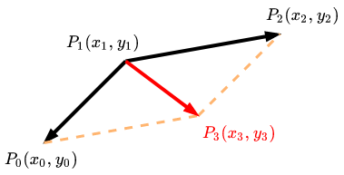
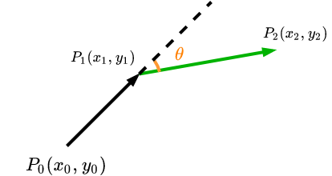
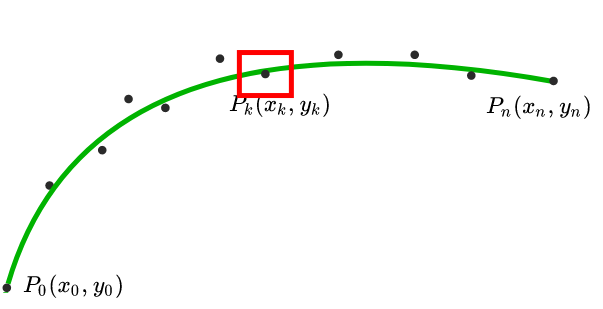
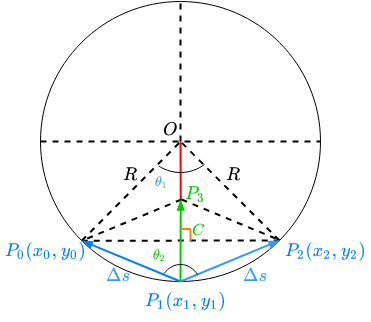

# 离散点曲线平滑原理

如下图所示，$P_0, P_1, P_2, P_3, \cdots, P_n$ $n$个离散点。此方法是通过对离散点的有限偏移平滑离散点组成的曲线。

**优化变量**：离散点坐标$(x_i, y_i)$

**优化目标**：

- 平滑度
- 长度
- 相对原始点偏移量

**目标函数设计**：$cost = cost_1 + cost_2 + cost_3$

其中：$cost_1$为平滑度代价，$cost_2$为长度代价，$cost_3$为相对原始点偏移量代价
$$
\begin{align}
cost_1 &= \sum^{n-1}_{i=1}(x_{i-1}+x_{i+1}-2 \times x_{i})^2+(y_{i-1}+y_{i+1}-2 \times y_{i})^2\\
cost_2 &= \sum^{n-1}_{i=0}(x_i-x_{i+1})^2 + (y_i-y_{i+1})^2\\
cost_3 & = \sum^{n-1}_{i=0}(x_i-x_{i-ref})^2 + (y_i-y_{i-ref})^2
\end{align}
$$
$cost_1$物理意义：如下图中红色向量$\vec{P_1P_3}$的模，它可以理解为：向量$\vec{P_1P_0}$和 向量$\vec{P_1P_2}$相加结果新的向量$\vec{P_1P_3}$的模平方。如果这三个点在一条直线上，那么这个值最小；三个点组成的两个线段的夹角$\theta$越大，即曲线越趋于平直，也因此越平滑。

关于平滑度的表示除了上面提到的$cost_1$形式之外，还存在其他形式去表示，如下图所示，连续3点 $P_0, P_1, P_2$ ，其中向量$\vec{P_0P_1} = (x_1-x_0, y_1-y_0)$和$\vec{P_1P_2} = (x_2-x_1, y_2-y_1)$之间的夹角$\theta$
$$
\begin{align}
cos\theta &= \frac{\vec{P_0P_1} \cdot \vec{P_1P_2}}{|\vec{P_0P_1}| |\vec{P_1P_2}|}\\
& = \frac{(x_1 - x_0)\times (x_2 - x_1) + (y_1 - y_0)\times (y_2 - y_1)} { \sqrt{(x_1 - x_0)^2+(y_1 - y_0)^2} / \sqrt{(x_2 - x_1)^2+(y_2 - y_1)^2}}
\end{align}
$$
$cos\theta$值越大，$\theta$越小，$P_0, P_1, P_2$ 越接近直线，曲线越平滑。

因此，$cost_1$可以表示为：
$$
cost_1= -\sum^{n-1}_{i=1}\frac{(x_{i} - x_{i-1})\times (x_{i+1} - x_{i}) + (y_{i} - y_{i-1})\times (y_{i+1} - y_{i})   }{\sqrt{(x_{i} - x_{i-1})^2+(y_{i} - y_{i-1})^2}  \sqrt{(x_{i+1} - x_{i})^2+(y_{i+1} - y_{i})^2}}
$$
这两种代价形式也是开源Apollo代码中discretized_points_smoothing中cos_theta_ipopt_interface、fem_pos_deviation_ipopt_interface、fem_pos_deviation_osqp_interface、fem_pos_deviation_sqp_osqp_interface方法中对应用到的基本原理。

$cost_2$物理意义：代表离散点之间距离平方之和

$cost_3$物理意义：代表优化后的离散点相对原始参考点偏移距离平方之和

**约束条件**：

- 位置约束
- 曲率约束
- 松弛变量

这里我们希望原始参考点的偏移量不应该太大，因此偏移量构成了第一个约束，如图中红色框所示把散点偏移量（X方向  Y方向）给限制在一定的范围内。

**位置约束**：
$$
x_{i-ref} - x_{l} \leq x_i \leq x_{i-ref} + x_{u}\\y_{i-ref} - y_{l} \leq x_i \leq y_{i-ref} + y_{u}
$$

除此之外，我们在路径规划的时候通常需要考虑转弯半径的约束，也就是路径需要满足一定的曲率约束。关于曲率的计算我们的主要思想在这里采取是三点构成一个圆的思想去求解半径，具体原理如下图所示：

如图所示，假设 $P_0, P_1, P_2$三点处在同一个圆上，当$\theta_1$较小时，向量$\vec{P_1P_0}$和 向量$\vec{P_1P_2}$的模近似等于弧长，因此有：
$$
\theta_1 = \frac{\Delta s} {R}
$$
根据$O-P_0-P_1$等腰三角形几何关系有：
$$
\theta_2 = \frac{\pi - \theta_1}{2}
$$
由于$|\vec{P_1P_0}|=|\vec{P_1P_2}|$，所以$C$是$P_1P_3$的中点，有$|\vec{P_1C}|=|\vec{CP_3}|$关系，由此得：
$$
|\vec{P_1P_3}| = 2P_1C
$$
根据$C-P_0-P_1$直角三角形几何关系有：
$$
P_1C = \Delta s \times cos(\theta_2)
$$
把$P_1C$带入$|\vec{P_1P_3}|$得：
$$
\begin{align}
|\vec{P_1P_3}| &= 2P_1C\\
& = 2 \times \Delta s \times cos(\theta_2)
\end{align}
$$
把$\theta_2$带入得：
$$
\begin{align}
|\vec{P_1P_3}| 
& = 2 \times \Delta s \times cos(\theta_2)\\
& = 2 \times \Delta s \times cos(\frac{\pi - \theta_1}{2})\\
& = 2 \times \Delta s \times cos(\frac{\pi}{2} - \frac{\theta_1}{2})\\
& = 2 \times \Delta s \times sin(\frac{\theta_1}{2})\\
& = 2 \times \Delta s \times \frac{\theta_1}{2}\\
& = \Delta s \times \theta_1\\
\end{align}
$$

把$\theta_1$带入得：
$$
\begin{align}
|\vec{P_1P_3}| 
& = \Delta s \times \theta_1\\
& = \Delta s \times \frac{dS} {R}\\
& = \Delta s^2 \times \frac{1} {R}\\
& = \Delta s^2 \times cur\\
\end{align}
$$

我们希望路径曲率约束满足车辆运动学最小转弯半径的约束，也就是满足 $|\vec{P_1P_3}| \leq R_{min}$也就是满足
$$
|\vec{P_1P_3}|\leq \Delta s^2 \times cur_{cstr}
$$
根据上式其中$n-2$个点中间点满足：
$$
(x_{i-1}+x_{i+1}-2 \times x_{i})^2+(y_{i-1}+y_{i+1}-2 \times y_{i})^2 \leq ({\Delta s}^2 \times cur_{cstr})^2 \quad i=1, 2, 3, \cdots, n-1
$$
其中：$\Delta s$ 是散点之间平均长度， $cur_{cstr}$是最大去率约束。

为了保证有解以及求解更快的收敛这里引入了大于0的松弛变量$stack_i$。因此：

**曲率约束**：
$$
(x_{i-1}+x_{i+1}-2 \times x_{i})^2+(y_{i-1}+y_{i+1}-2 \times y_{i})^2 - stack_i\leq ({\Delta s}^2 \times cur_{cstr})^2  \quad i=1, 2, 3, \cdots, n-1
$$

**松弛变量约束**：
$$
0 \leq stack_i \leq +\infty
$$
**曲率约束的线性化**

至此，作为一个优化问题，模型基本建立，通过观察我们可以知道目标函数为二次方程，但是很遗憾约束条件里面关于曲率约束是非线性的。此问题除了直接使用IPOPT求解之外，经过思考我们可以通过线性化方法把曲率约束转化成线性约束之后就可以把问题转化为二次优化问题使用OSQP加速求解。

假设：
$$
F = (x_{i-1}+x_{i+1}-2 \times x_{i})^2+(y_{i-1}+y_{i+1}-2 \times y_{i})^2 - stack_i \quad i=1, 2, 3, \cdots, n-1
$$
泰勒展开：
$$
F(X) = F(X_0) + \frac{F'(X_0)}{1!}(X-X_0) + \frac{F^{''}(X_0)}{2!}(X-X_0)^2 + \cdots + \frac{F^{n}(X_0)}{n!}(X-X_0)^n
$$
线性化只保留一阶项：
$$
F(X) = F(X_0) + F'(X_0)(X-X_0)
$$
$F(X)$在原始参考点$X_{ref}$处的值为：
$$
F(X_{ref}) = (x_{i-1-ref}+x_{i+1-ref}-2 \times x_{i-ref})^2+(y_{i-1-ref}+y_{i+1-ref}-2 \times y_{i-ref})^2 - stack_i
$$
$F(X)$在原始参考点$X_{ref}$处的导数为：

从曲率约束方程我们可以看到包含6个变量：$x_{i-1},x_i,x_{i+1},y_{i-1},y_i,y_{i+1}$，对方程求导得：
$$
F'(X_{ref}) = \begin{equation}
\left[
\begin{array}{c}
\frac{\partial f}  {\partial x_{i-1}} \\
\frac{\partial f}  {\partial y_{i-1}}\\
\frac{\partial f}  {\partial x_{i}} \\
\frac{\partial f}  {\partial y_{i}}\\
\frac{\partial f}  {\partial x_{i+1}}\\
\frac{\partial f}  {\partial y_{i+1}}
\end{array}
\right]
\end{equation}_{ref}
$$
其中包含6个变量：$x_{i-1},x_i,x_{i+1},y_{i-1},y_i,y_{i+1}$：
$$
\begin{align}
\frac{\partial F}  {\partial x_{i-1}} &= 2 \times (x_{i-1}+x_{i+1}-2 \times x_{i}) \\
\frac{\partial F}  {\partial y_{i-1}} &= 2 \times (y_{i-1}+y_{i+1}-2 \times y_{i}) \\
\frac{\partial F}  {\partial x_{i}}   &= -2 \times 2 \times (x_{i-1}+x_{i+1}-2 \times x_{i}) \\
\frac{\partial F}  {\partial y_{i}}   &= -2 \times 2 \times (y_{i-1}+y_{i+1}-2 \times y_{i}) \\
\frac{\partial F}  {\partial x_{i+1}} &= 2 \times (x_{i-1}+x_{i+1}-2 \times x_{i}) \\
\frac{\partial F}  {\partial y_{i+1}} &= 2 \times (y_{i-1}+y_{i+1}-2 \times y_{i}) \\
\end{align}
$$

因此：
$$
F(X) = F(X_{ref}) + F'(X_{ref})(X-X_{ref})
$$
带入曲率约束方程得：
$$
\begin{align}
F(X_{ref}) + F'(X_{ref})(X-X_{ref}) \leq ({\Delta s}^2 \times cur_{cstr})^2  \quad i=1, 2, 3, \cdots, n-1
\end{align}
$$
曲率线性化约束化简：
$$
 F'(X_{ref})X \leq ({\Delta s}^2 \times cur_{cstr})^2 - F(X_{ref}) + F'(X_{ref})X_{ref}  \quad i=1, 2, 3, \cdots, n-1
$$

**参考**：

https://github.com/ApolloAuto/apollo/tree/master/modules/planning/math/discretized_points_smoothing

